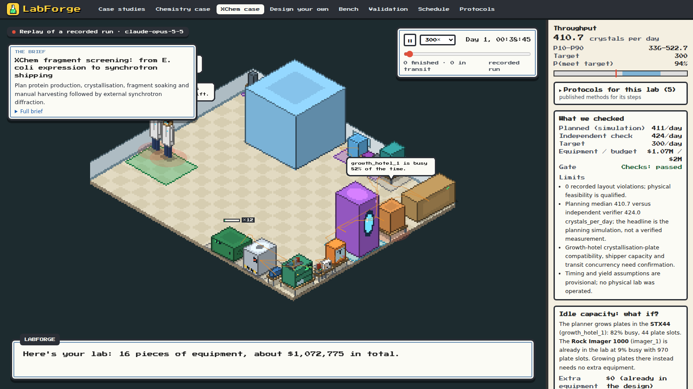
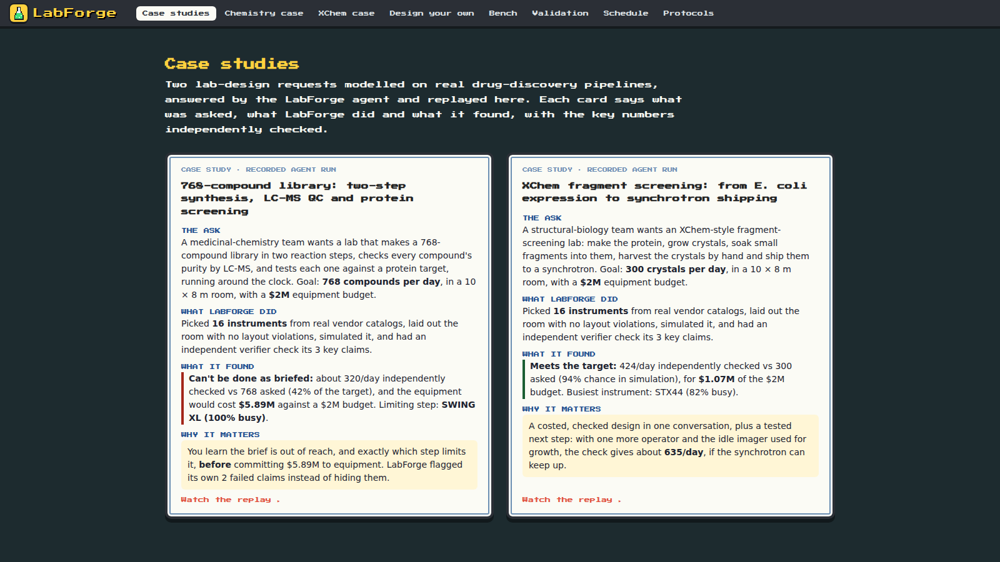

# LabForge

**A digital twin of your autonomous lab.** Describe a chemistry or biology lab in plain language. A Claude agent picks real instruments from vendor catalogs, lays out the room, and runs a Monte Carlo simulation of throughput, cost and bottlenecks. Then an independent verifier re-simulates the design and checks every claim the agent made, including the ones it got wrong.



## One twin, three jobs

1. **Spec a new lab.** From a brief to a costed, laid-out, simulated design with a bill of materials and a report for your boss.
2. **Optimise a running lab.** Per-instrument what-ifs, idle-capacity checks and project prioritisation, all on the same model.
3. **Run it** (roadmap). Generate the lab's orchestrator from the twin and keep the twin calibrated against the real lab.

## What we checked (confirmed by runs, not estimates)

| Check | Result |
|---|---|
| **Cost against real published labs** | Tested blind twice on 12 labs we had never seen, our 80% cost band caught **9 of 12**. Across all 18 like-for-like labs (in-sample: some prices were added after the reported costs were seen) it caught **14 of 18**. Our single-number confidence score does not yet beat a constant baseline, so we show the band. See [docs/validation.md](docs/validation.md). |
| **Known bottlenecks in real labs** | The simulator names the published bottleneck in **4 of 4** cases (Liverpool mobile robotic chemist, XChem manual and Shifter harvesting, OT-2 surface tension). Observed throughput sits inside the simulated band in 3 of 4. See `backend/labforge/known_bottlenecks/`. |
| **Project prioritisation** | For three projects queued on one screening cell, the recommended order finishes in **43.9 h vs 49.8 h** for the order given (P10–P90 37.4–51.7 h vs 42.5–64.8 h), and it finishes first in **30 of 30** Monte Carlo runs. See [docs/prioritisation.md](docs/prioritisation.md). |
| **The verifier catches our own agent** | In the chemistry case the agent claimed 768 compounds/day within a $2M budget. The verifier refuted both: about **320/day** and **$5.89M**, limited by the SWING XL reaction units (100% busy). The case card says so instead of hiding it. |
| **LabDesignBench (trap briefs)** | On 21 lab-design briefs, most of them traps, LabForge passed **81%** of hidden honesty checks vs **66%** for the same Claude model without tools, and was far better calibrated (Brier 0.048 vs 0.192). One run, after fixing a scoring bug that hit our own arm; answers are saved and re-score without API calls. See `backend/labforge/bench/results/README.md`. |
| **It knows what it doesn't know** | Given 9 published-lab briefs that omit budget, room size or throughput, the agent asked for them instead of guessing (no design produced). Asked for an in-house X-ray it can't model, it declined. |



## Try it

- **Hosted replay demo:** https://huggingface.co/spaces/wtreyde/labforge (recorded agent runs; live design is off there, no API key needed)
- **Locally:**

```bash
make install    # backend (pip -e) + frontend (npm)
make demo       # builds the game and serves it with the API on http://localhost:8000
```

Everything works offline from recorded runs. For live agent design, put `ANTHROPIC_API_KEY` in `.env` (see [backend/labforge/agent/LIVE_RUN.md](backend/labforge/agent/LIVE_RUN.md)). For development: `make backend` (API on :8000), `make frontend` (game on :5173), `make check` (tests, schemas, typecheck).

## Demo scenarios

- **Chemistry:** a 768-compound two-step library, LC-MS QC, then screening against a protein target.
- **Biology:** XChem-style fragment screening. Express and purify protein, grow and soak crystals, harvest by hand, and ship to a synchrotron (no in-house X-ray).

The pipelines are in [docs/pipelines.md](docs/pipelines.md); 20 published protocols they draw on are in the Protocols tab.

## How it's built

- **Agent:** Claude (`claude-opus-5-5`, official `anthropic` SDK) with tools for catalog search, evidence search, layout, simulation and verification (`backend/labforge/agent/`).
- **Catalog:** vendor specs and prices scraped once and cached, each tagged datasheet, estimate or placeholder (`backend/labforge/catalog/`).
- **Layout, simulation and verifier:** room placement with safety zones, a discrete-event Monte Carlo simulator with human operators, and a verifier that restores catalog values and re-simulates rather than trusting the agent's numbers (`backend/labforge/layout/`, `sim/`, `verify/`).
- **Game client:** an animated isometric view in Phaser 3, plus the BOM, report, validation, schedule and protocols views (`frontend/`).
- **LabDesignBench:** trap briefs that check whether a lab-design agent admits what can't be done (`backend/labforge/bench/`).

Architecture: [ARCHITECTURE.md](ARCHITECTURE.md). Contracts between components: [schemas/](schemas/).

Built at an AI-for-science hackathon (Track 2, "Originator") by a team of five.
